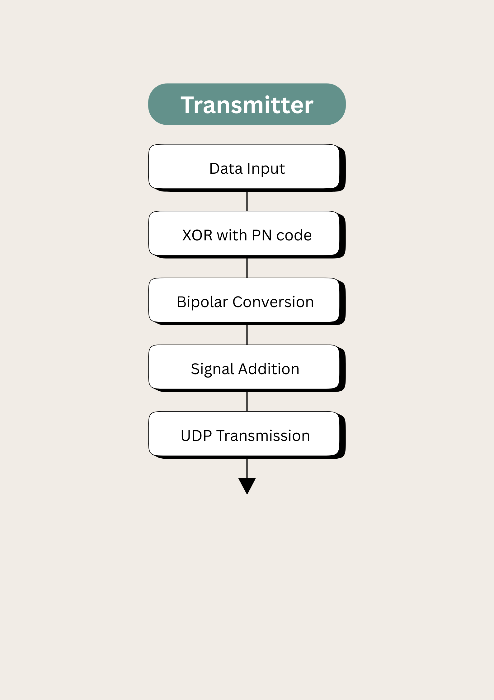
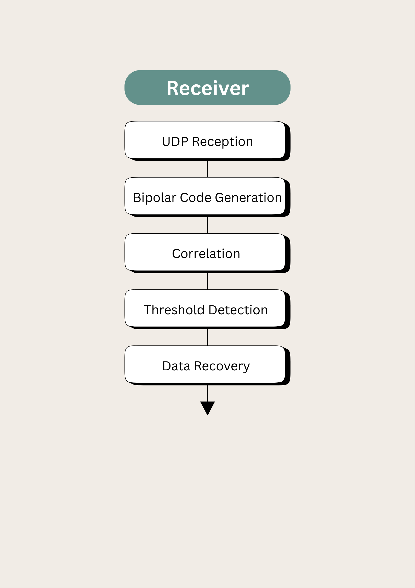

# Secure Multi-User CDMA Communication System

A Python-based implementation of a secure multi-user CDMA communication system using UDP sockets, spread spectrum encoding, and correlation-based decoding.

---

## Overview

This project demonstrates the implementation of a **Code Division Multiple Access (CDMA)** communication system in Python. Multiple users can simultaneously transmit data over a shared communication channel using unique Pseudo Noise (PN) codes.

The encoded signals are transmitted using **UDP socket programming**, while the receiver reconstructs the original data using **correlation-based decoding**.

---

## Features

- Multi-user CDMA communication
- Spread spectrum encoding
- XOR-based PN code generation
- Bipolar signal conversion
- Composite signal generation
- UDP socket communication
- Correlation-based decoding
- Accurate data recovery

---

## Technologies Used

- Python
- UDP Sockets
- NumPy
- Digital Communication
- CDMA
- Signal Processing

---

## Project Structure

```text
secure-multiuser-cdma-communication
│
├── src
│   ├── sender.py
│   ├── receiver.py
│   ├── encode.py
│   └── decode.py
│
├── notebook
│   └── DigiComm.ipynb
│
├── images
│   ├── transmitter.png
│   └── receiver.png
│
├── report
│   └── Project_Report.pdf
│
├── README.md
└── requirements.txt
```

---

## System Workflow

### Transmitter



### Receiver



---

## How It Works

1. User data is entered.
2. Each user's data is encoded using a unique PN code.
3. The encoded bits are converted into bipolar signals.
4. Multiple user signals are combined into a composite CDMA signal.
5. The composite signal is transmitted over UDP sockets.
6. The receiver performs correlation using the corresponding PN code.
7. The original user data is recovered.

---

## Running the Project

### Start the transmitter

```bash
python src/sender.py
```

### Start the receiver

```bash
python src/receiver.py
```

---

## Team Members

- **P. Akshara Kruti**
- **Pranav Turala**

---

## My Contribution

I was responsible for the **receiver (decoding)** side of the project, including:

- UDP-based signal reception
- Correlation-based CDMA decoding
- Bipolar PN code generation
- Threshold detection
- Original data recovery

---

## Future Improvements

- GUI for easier interaction
- Support for additional users
- Noise simulation and error analysis
- Real-time visualization of transmitted signals

---

## License

This project was developed for academic purposes as part of the **Digital Communication (20CYS301)** course.
